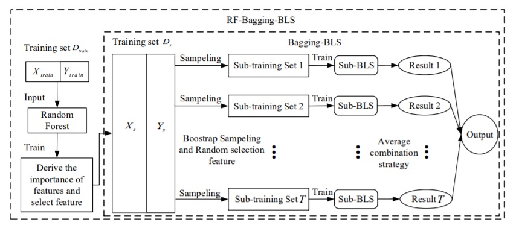
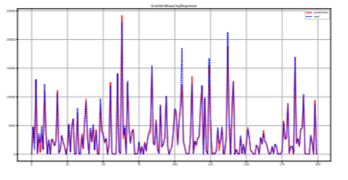

# About Me

# Education

# Publications

<table style="width:100%;border:0px;border-spacing:0px;border-collapse:separate;margin-right:auto;margin-left:auto;">
       <tbody>
          <tr>
            <td style="padding:10px;width:50%;vertical-align:middle">
              
            </td>
            <td width="50%" valign="middle">
              <a href="https://ieeexplore.ieee.org/document/9380648/keywords#keywords">
                <papertitle>Random-Forest-Bagging Broad Learning System with Applications for COVID-19 Pandemic</papertitle>
              </a>
	       
	       
              <a href="https://scholar.google.com/citations?user=CQjEUkAAAAAJ&hl=en">Choujun Zhan</a>,
	      <strong>Yufan Zheng</strong>,
              <a href="https://scholar.google.com/citations?hl=en&user=XEiWEDAAAAAJ">Haijun Zhang</a>,
              <a href="https://www.researchgate.net/scientific-contributions/Quansi-Wen-2157669220">Quansi Wen</a>
	       
	       
              <a href="https://ieeexplore.ieee.org/xpl/RecentIssue.jsp?punumber=6488907">IEEE Internet of Things Journal</a>, March 2021
	       
	       
              
We combine the bagging strategy and Broad Learning System to develop a Random-forest-Bagging Broad Learning System (RF-Bagging-BLS) approach to forecast the trend of the COVID-19 pandemic. And the proposed model demonstrates superior predictive power over other benchmark models.

	       
	      <a href="bib/zhan2021random.bib">bibtex</a>
            </td>
          </tr>
	</tbody>
</table>

<table style="width:100%;border:0px;border-spacing:0px;border-collapse:separate;margin-right:auto;margin-left:auto;">
       <tbody>
          <tr>
            <td style="padding:10px;width:50%;vertical-align:middle">
              
            </td>
            <td width="50%" valign="middle">
              <a href="https://link.springer.com/article/10.1007/s00521-020-05285-9">
                <papertitle>Identifying epidemic spreading dynamics of COVID-19 by pseudocoevolutionary simulated annealing optimizers</papertitle>
              </a>
	       
	       
              <a href="https://scholar.google.com/citations?user=CQjEUkAAAAAJ&hl=en">Choujun Zhan</a>,
	      <strong>Yufan Zheng</strong>,
              <a>Zhikang Lai</a>,
              <a href="https://dblp.org/pid/81/6701.html">Tianyong Hao</a>,
              <a>Bing Li</a>
	       
	       
              <a href="https://www.springer.com/journal/521">Neural Computing and Applications</a>, August 2020
	       
	       
              
We propose a pseudo-coevolutionary simulated annealing (SA) algorithm to identify the parameters of a model integrating the daily intercity migration network, which is constructed from real-world migration records and the Susceptible–Exposed–Infected–Removed model (SEIR), and use the model to predict the spread of the COVID-19 epidemic in over 300 cities in China.

	       
	      <a href="bib/zhan2021identifying.bib">bibtex</a>
            </td>
          </tr>
	</tbody>
</table>

<table style="width:100%;border:0px;border-spacing:0px;border-collapse:separate;margin-right:auto;margin-left:auto;">
       <tbody>
          <tr>
            <td style="padding:10px;width:50%;vertical-align:middle">
              
            </td>
            <td width="50%" valign="middle">
              <a href="https://ieeexplore.ieee.org/document/8958631">
                <papertitle>Movie box office prediction based on ensemble learning</papertitle>
              </a>
	       
	       
              <a>Shuangyan Wu</a>,
	      <strong>Yufan Zheng</strong>,
              <a>Zhikang Lai</a>,
              <a>Fujian Wu</a>,
              <a href="https://scholar.google.com/citations?user=CQjEUkAAAAAJ&hl=en">Choujun Zhan</a>,
	       
	       
              <a href="https://ieeexplore.ieee.org/xpl/conhome/8954856/proceeding">IEEE Symposium on Product Compliance Engineering - Asia (ISPCE-CN)</a>, January 2020
	       
	       
              
We built a predictive model using film data from 1980 to 2018 and machine learning methods, including the Ensemble learning algorithm.

	       
	      <a href="bib/wu2019movie.bib">bibtex</a>
            </td>
          </tr>
	</tbody>
</table>

# Research Experience

# Awards

# Talks

# Skills

