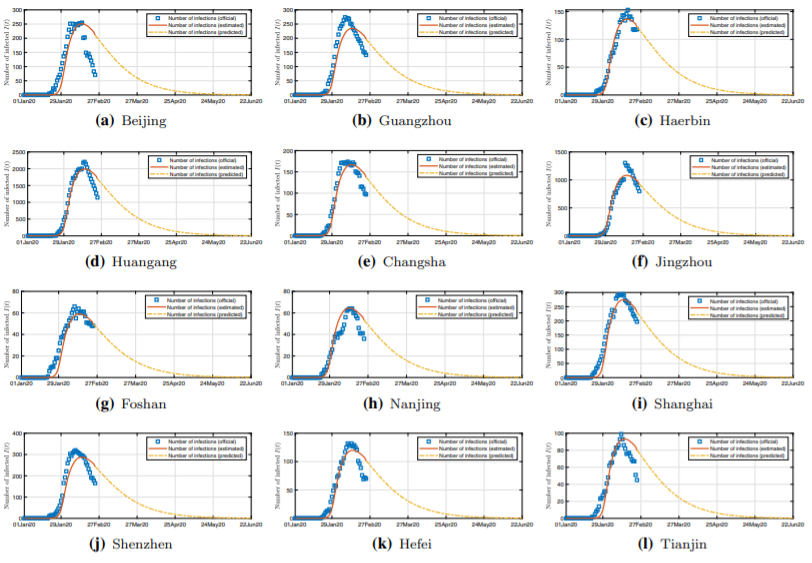

# About Me

# Education

# Publications

<table style="width:100%;border:0px;border-spacing:0px;border-collapse:separate;margin-right:auto;margin-left:auto;">
       <tbody>
          <tr>
            <td style="padding:10px;width:50%;vertical-align:middle">
              
            </td>
            <td width="50%" valign="middle">
              <a href="https://link.springer.com/article/10.1007/s00521-020-05285-9">
                <papertitle>Identifying epidemic spreading dynamics of COVID-19 by pseudocoevolutionary simulated annealing optimizers</papertitle>
              </a>
	       
	       
               
              <a href="http://www.eecs.berkeley.edu/%7Eallie/">Choujun Zhan</a>,
	      <strong>Yufan Zheng</strong>,
              <a href="http://sergeykarayev.com/">Zhikang Lai</a>,
              <a href="http://www.eecs.berkeley.edu/%7Ejiayq/">Tianyong Hao</a>,
              <a href="http://www.cs.berkeley.edu/%7Emfritz/">Bing Li</a>
	       
	       
	       
              <em>Neural Computing and Applications</em>, August 2020
               
              
We propose a pseudo-coevolutionary simulated annealing (SA) algorithm to identify the parameters of a model integrating the daily intercity migration network, which is constructed from real-world migration records and the Susceptible–Exposed–Infected–Removed model, and use the model to predict the spread of the COVID-19 epidemic in over 300 cities in China.

	       
	       
	      <a href="bib/zhan2021identifying.bib">bibtex</a>
            </td>
          </tr>
	</tbody>
</table>

# Research Experience

# Awards

# Talks

# Skills

